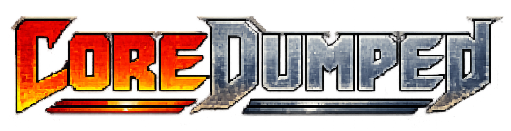

# CoreDumped



*A roguelike where the enemies run on Lisp you can read, edit, and break.*

Welcome, traveler.

Before thee lies a dungeon of rules, memories, slimes, and suspiciously readable
machinery. **CoreDumped** is a text-graphical roguelike about understanding,
editing, and eventually rewriting the rules of the thing trying to kill you.

It's also a tragic game about love, family, CYBERSECURITY EXPLOITS, and the beauty of coding macros to do repetitive tacks. I hope you like it, and enjoy the journey. If you're too impatient, the lore is documented [here](./level-design.md).

CoreDumped is built on the **Xlyph** engine, a reusable framework for
Glyph-powered (a custom LISP) roguelikes. The engine provides the ECS, map,
rules registry, rendering, and Glyph language runtime. The terminal frontend is
drawn directly with `crossterm`; the engine uses small bracket crates for color,
geometry, pathfinding, and random numbers.

## Play

```bash
cargo run -p xlyph-tui
```

Move with arrow keys or hjkl, descend stairs, inspect enemies, and when you
feel like poking around, open the console with backtick and submit code with
Enter.

## Why

Every roguelike has rules, but most hide them behind source code or wiki pages.
CoreDumped puts them on screen and lets you poke at them.

The long bet is that if the game shows you its moving parts, the mystery shifts
from "how does this work" to "what can I make it do." The inspector and console
are the core interface rather than a hack bolted on top, and the dungeon is a
Lisp runtime with graphics attached.

### What works now

- ~18 hand-crafted levels (17 narrative + procedural fallback)
- Turn-based movement, pathing enemies, directional flashlight
- Inspector panel showing real Glyph source for every AI rule
- Working Glyph console — eval expressions, inspect state, bind keys
- Custom ECS (entity-component-system), no external dependency
- Deterministic turn model: `ActionCost::Tick` = player + enemies advance;
  `ActionCost::Free` = UI only
- Playbook system: drop `.glyph` files in `~/.coredumped/playbooks/current/`,
  they load on game start
- Save/load (auto-save on quit, manual slots)

### What doesn't work yet

- No full procedural generation (fixed maps, but 18 is enough for a run)
- No full FoV / fog of war (flashlight serves to indicate direction)
- No inventory beyond held keys and special items
- Half-finished Glyph standard library (enough for enemies, not much else)
- Not balanced. At all.

## Architecture

**Engine/game split**: The **Xlyph** engine handles the ECS, map, rules
registry, Glyph runtime, and event log. **CoreDumped** is the game built on top
of it with levels, world state, save system, and player profile. They share a
repo but someone could build different levels on the same engine.

**ECS**: Custom in-house with no external dependency. `EntityId` is a stable
handle and component stores are `BTreeMap<EntityId, T>` with marker sets for
alive and enemy-ai tracking. There is no systems abstraction layer; game logic
reads and writes the ECS directly, which keeps the codebase around forty source
files total.

**Turn model**:

```rust
pub enum ActionCost { Free, Tick, Quit }
```

Every gameplay action costs a tick, and every tick advances enemies once. UI
actions like the inspector, console, and typing are free, and this invariant is
tested.

**Glyph embedding**: Each `BuiltinFn` signature takes a `World` reference
alongside the value stack, environment, and sandbox options. Game builtins for
printing, inspecting, and toggling the console access World directly, and the
same eval path runs enemy AI rules, console expressions, and keybindings
without FFI or a scripting bridge: everything is Rust functions registered in
the environment.

**Levels are callbacks**: Each depth (0–17) is a function that receives `&mut World`
and places entities, sets terrain, configures wizard dialogue. Depth 18+ falls
through to a procedural builder.

## Controls

| Key | Action |
| --- | --- |
| Arrow keys / `h j k l` | Move / bump |
| `.` | Wait one tick |
| `i` | Toggle inspector |
| <code>\`</code> | Toggle console |
| `Enter` | Submit console expression |
| `PageUp` / `PageDown` / mouse wheel | Scroll log, console output, or overlay |
| `Home` / `End`, `Ctrl+A`, `Ctrl+K`, `Ctrl+U`, `Ctrl+W` | Edit console input |
| `Alt+B` / `Alt+F` or word-arrow keys | Move by console word |
| `Esc` | Close overlay / cancel quit |
| `q` | Quit |

## Development

```bash
cargo test        # 122 tests, pure game logic (no renderer)
cargo fmt         # single crate, no config
cargo check       # fast feedback
```

The most important tests verify the turn invariant: that gameplay costs ticks,
UI actions do not, and enemies advance exactly once per tick.

## Status

This is a beta, playable from depth 0 to depth 17 with an ending in place.
Expect rough edges, missing content, and things that kill you without
explanation.

The engine comes to about 13k lines of Rust, half of which is the Glyph
interpreter; if the project stops here, the codebase is small enough that
someone could learn from it in an afternoon.

## License

MIT
